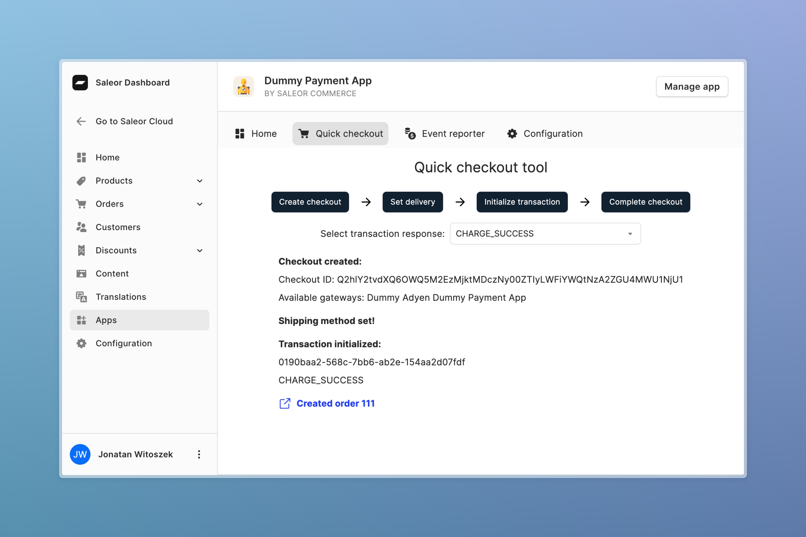

  <h1>Dummy Payment App</h1>

  
Bare-bones app for testing Saleor's <a href="https://docs.saleor.io/docs/developer/payments#payment-app">Transactions API</a>

  <a href="https://saleor.io/">Website</a>
   | 
  <a href="https://docs.saleor.io/docs/3.x/">Docs</a>

> [!TIP]
> Questions or issues? Check our [discord](https://discord.gg/H52JTZAtSH) channel for help.

### What is Dummy Payment App?

The Dummy Payment App allows you to test Saleor's payment and checkout features without needing to set up a real payment provider. You can create orders, process payments, issue refunds, and more, all within the Saleor Dashboard.

### App features

- Create new checkouts and orders from the Saleor Dashboard:

- Process payments and update transaction statuses:

> [!TIP]
> Each Transaction has `externalUrl` that links to this page from Order details page in Saleor Dashboard:

- Issue refunds, process charges and cancellations for Transactions

### How does it work?

The Dummy Payment App supports the following webhooks to enable payment flows:

The app implements webhooks to process payments initiated from your storefront:

- `PAYMENT_GATEWAY_INITIALIZE_SESSION`
- `TRANSACTION_INITIALIZE_SESSION`
- `TRANSACTION_PROCESS_SESSION`

It also implements webhooks to allow updating the status of Transactions from the Saleor Dashboard, similar to how a real third-party payment provider would:

- `TRANSACTION_REFUND_REQUESTED`
- `TRANSACTION_CHARGE_REQUESTED`
- `TRANSACTION_CANCELATION_REQUESTED`

### Learn more

#### Docs

- [**Apps guide**](https://docs.saleor.io/docs/developer/extending/apps/overview) - learn more how to build your own Saleor app
- [**Transactions API**](https://docs.saleor.io/docs/developer/payments) - learn how to use Transactions API in your store
- [**Payment App webhooks**](https://docs.saleor.io/docs/developer/extending/webhooks/synchronous-events/transaction) - learn how to build your own Payment App

#### Examples

- [**Stripe Payment App**](https://github.com/saleor/saleor-app-payment-stripe)
- [**Stripe Example Storefront**](https://github.com/saleor/example-nextjs-stripe)

## Development

You can find docs about App development in the [Saleor documentation](https://docs.saleor.io/developer/extending/apps/developing-apps/app-examples).

## Support

Please open GitHub issues if you find any problem with this app. PRs are welcome too 😄

You can find help with Saleor in these places:

- [GitHub Discussions](https://github.com/saleor/saleor/discussions)
- [Saleor Discord](https://discord.gg/H52JTZAtSH)

## Credits

- App logo: [Lucide](https://lucide.dev/license)
